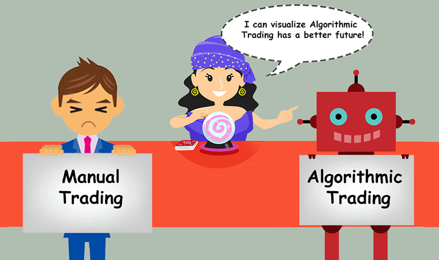
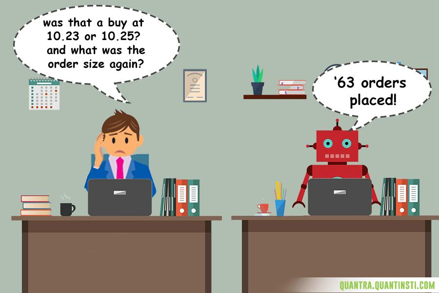
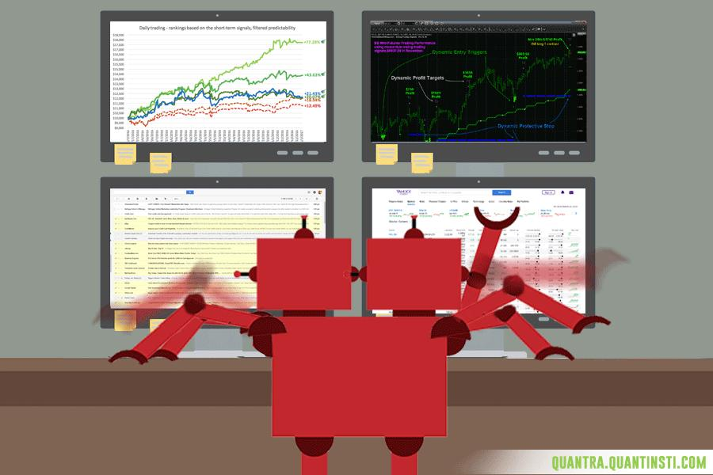
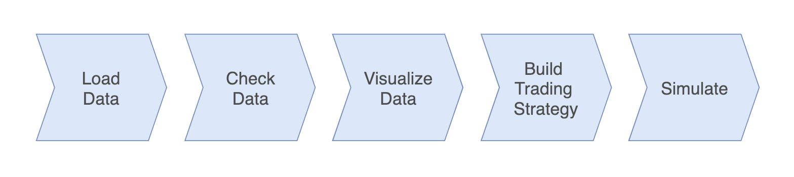
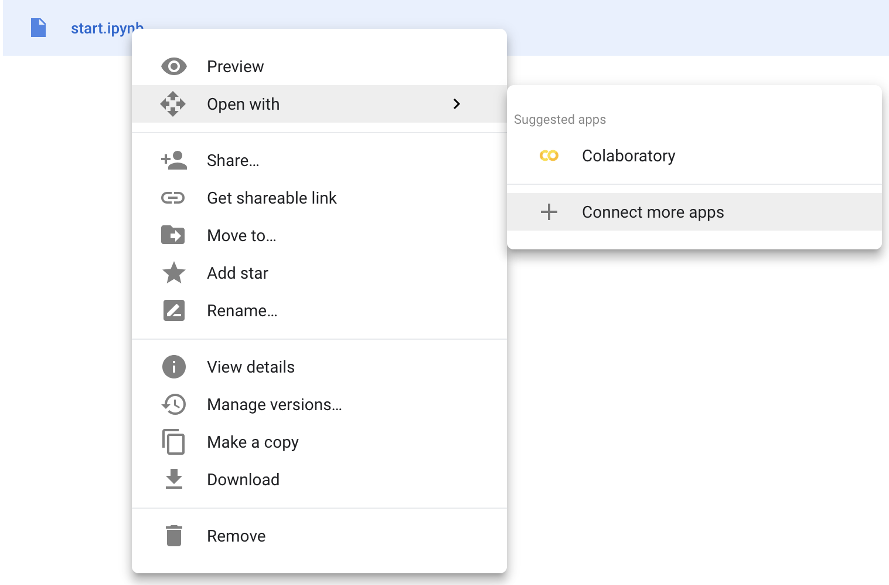
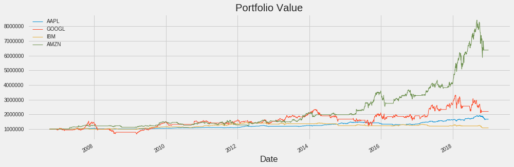

# NTUOSS Data Science for Algorithmic Trading Workshop

*by [Tu Anqi](https://github.com/anqitu) for NTU Open Source Society*

This workshop assumes basic knowledge of Python.

**Disclaimer:** *This document is only meant to serve as a reference for the attendees of the workshop. It does not cover all the concepts or implementation details discussed during the actual workshop.*
___

### Workshop Details
**When**: Friday, 5 April 2018. 6:30 PM - 8:30 PM.</br>
**Where**: LT1 </br>
**Who**: NTU Open Source Society

### Questions
Please raise your hand any time during the workshop or email your questions to [me](mailto:anqitu@outlook.com) later.

### Errors
For errors, typos or suggestions, please do not hesitate to [post an issue](https://github.com/anqitu/NTUOSS-DataScienceforAlgorithmicTradingWorkshop/issues/new). Pull requests are very welcome! Thanks!
___

## Task 0 - Getting Started

#### 0.1 Introduction

### **84% of trades in NYSE were done using algorithmic trading!**

For this workshop, we'll be developing our own strading strategy and simulate it with historic stock market data on Colaboratory.

<p align="center">
  
</p>

1. What is [Algorithmic Trading](https://www.investopedia.com/articles/active-trading/101014/basics-algorithmic-trading-concepts-and-examples.asp)?\
Algorithmic trading (automated trading, black-box trading or simply algo-trading) is the process of using computers programed to follow a defined set of instructions (an algorithm) for placing a trade in order to generate profits at a speed and frequency that is impossible for a human trader. The defined sets of rules are based on timing, price, quantity or any mathematical model.</br>
**Video Links:**
- https://www.youtube.com/watch?v=ezom23o2boM
- https://www.youtube.com/watch?v=TYUBnCC18g0
- https://www.youtube.com/watch?v=Tj5wX5p4DCY

2. What are the benefits of Algorithmic Trading?
<p align="center">
  
</p>

- Human Emotions = 0
<p align="center">
  
</p>

<p align="center">
  
</p>

- Accuracy + Speed = 100
<p align="center">
  
</p>

- Scalability = level 1000
<p align="center">
  
</p>


3. What is [Colaboratory](https://colab.research.google.com/notebooks/welcome.ipynb)?\
Colaboratory is a Google research project created to help disseminate machine learning education and research. It is a free Jupyter notebook environment that requires no setup and runs entirely in a virtual machine (VM) hosted in the cloud.


#### 0.2 Overview

Here is an overview of today's workshop.
<p align="center">
  
</p>

#### 0.3 Initial Setup

Download this [file](https://workupload.com/file/EGNA4GaQ) and add to your own google drive. This start.ipynb file is a Jupyter notebook that contains the incomplete script that you are going to code on for today's workshop

Let's open the 'start.ipynb' file together to officially start the coding part of today's workshop: Right click 'start.ipynb' file -> Select 'Open with' -> Select 'Colaboratory'.

<p align="center">
  
</p>

If you do not have any app to open the notebook yet, follow the steps as shown below: Right click 'start' file -> Select 'Connect more apps' -> Search for 'colaboratory' -> Click on 'connect'.

<p align="center">
  
</p>

<p align="center">
  
</p>


## Task 1 - Set Up

#### 1.1 Import Necessary Libraries
Firstly, we need to import some useful libraries for manipulating data.
- [```Pandas```](https://pandas.pydata.org/): An open source library providing high-performance, easy-to-use data structures and data analysis tools for Python.
- [```Numpy```](http://www.numpy.org/): A fundamental package for scientific computing with Python.
- [```Matplotlib```](https://matplotlib.org/): A Python 2D plotting library which produces publication quality figures in a variety of hardcopy formats and interactive environments across platforms.

```python
# TASK 1.1: Import libraries
import pandas as pd
import numpy as np
import matplotlib.pyplot as plt
%matplotlib inline
plt.style.use('fivethirtyeight')

#ignore warnings
import warnings
warnings.filterwarnings('ignore')
```

#### 1.2 Import Financial Data
The [```pandas_datareader```](https://pandas-datareader.readthedocs.io/en/latest/index.html) package allows for reading in data from sources such as Google, Yahoo! Finance, World Bank,… For today's workshop, we will use the package to read in data from Yahoo! Finance.

```python
# TASK 1.2: Import Apple's stock market price from 2006 to 2019
import pandas_datareader as pdr
import datetime
aapl = pdr.get_data_yahoo('AAPL',
                          start=datetime.datetime(2006, 10, 1),
                          end=datetime.datetime(2019, 1, 1))
```


## Task 2 - Work with Pandas Dataframe
As we have used ```pandas_datareader``` to import data into our workspace, the object aapl is a Pandas dataframe, which is a 2-dimensional data structure with columns of various types.

#### 2.1 Check Data
Let's see how the Pandas Dataframe look like.
```python
# Task 2.1.1 Check the structure of a Pandas Dataframe
print(aapl)
```

This dataframe contains six columns – High, Low, Open, Close, Volume and Adj Close.
- High and Low represent the maximum, minimum, and last price of the share for the day.
- The columns Open and Close represent the starting and final price at which the stock is traded on a particular day.
- Volume is the number of shares bought or sold in the day
- [Adj Close](https://www.investopedia.com/terms/a/adjusted_closing_price.asp) is the adjusted closing price: it’s the closing price of the day that has been slightly adjusted to include any actions that occurred at any time before the next day’s open. You can use this column to examine historical returns or when you’re performing a detailed analysis on historical returns.

Another important thing to note is that the market is closed on weekends and public holidays. As shown in the above data, some date values are missing – 2006-10-07, 2006-10-08, 2006-10-14.

Since the data got so many rows, let's get some useful summary statistics.
```python
# Task 2.1.2 Use the describe() function to get some useful summary statistics about your data
print(aapl.describe(include = 'all'))
```

Then, check its general information, including the type of each column, number of entries, index and size.
```python
# Task 2.1.3 Check the general information of the dataframe
print(aapl.info())
```
Check the shape, columns and index.
```python
# Task 2.1.4 Check the shape, columns and index of a Pandas Dataframe
print(aapl.shape)
print(aapl.columns)
print(aapl.index)
```

Inspect first few rows of the dataframe
```python
# Task 2.1.5 Check first few rows of dataframe
print(aapl.head())
```
Inspect last 10 rows of the dataframe by changing the default from 5 to 10
```python
# Task 2.1.6 Check last 10 rows of dataframe
print(aapl.tail(10))
```
Check whether there is any missing values
```python
# Task 2.1.7 Check the existence of null values
print(aapl.isnull().sum())
```

#### 2.2 Clean Data
The profit or loss calculation is usually determined by the closing price of a stock for the day, hence we will need the closing price as the target variable. Besides, for the return analysis of the simulation, we also need the adjusted closing price. All other columns can be taken off for this workshop.

To do this, we can either drop unwanted columns
```python
# Task 2.2.1 Drop unwanted columns
aapl = aapl.drop(columns = ['High', 'Low'])
```

Or keep wanted columns
```python
# Task 2.2.2 Keep wanted columns
aapl = aapl[['Close', 'Adj Close']]
```


## Task 3 - Visualiza Data (Exploratory Data Analysis)
Lets's make make a simple time series plot of closing price. We can plot data directly from the DataFrame using the plot() method

```python
# Task 3.1 Plot the closing price
data['Close'].plot()
```

The plot looks not very nice. Let's add some adjustments to the argument.
```python
# Task 3.2 Plot the closing price with some nice adjustments
aapl['Close'].plot(figsize = (15,5), linewidth = 1, legend = True)
```
Let's compare to the online chart from [Yahoo Finance!](https://finance.yahoo.com/quote/AAPL/chart?p=AAPL#eyJpbnRlcnZhbCI6Im1vbnRoIiwicGVyaW9kaWNpdHkiOjEsImNhbmRsZVdpZHRoIjo3LjgyNzU4NjIwNjg5NjU1Miwidm9sdW1lVW5kZXJsYXkiOnRydWUsImFkaiI6dHJ1ZSwiY3Jvc3NoYWlyIjp0cnVlLCJjaGFydFR5cGUiOiJsaW5lIiwiZXh0ZW5kZWQiOmZhbHNlLCJtYXJrZXRTZXNzaW9ucyI6e30sImFnZ3JlZ2F0aW9uVHlwZSI6Im9obGMiLCJjaGFydFNjYWxlIjoibGluZWFyIiwicGFuZWxzIjp7ImNoYXJ0Ijp7InBlcmNlbnQiOjEsImRpc3BsYXkiOiJBQVBMIiwiY2hhcnROYW1lIjoiY2hhcnQiLCJ0b3AiOjB9fSwibGluZVdpZHRoIjoyLCJzdHJpcGVkQmFja2dyb3VkIjp0cnVlLCJldmVudHMiOnRydWUsImNvbG9yIjoiIzAwODFmMiIsInN5bWJvbHMiOlt7InN5bWJvbCI6IkFBUEwiLCJzeW1ib2xPYmplY3QiOnsic3ltYm9sIjoiQUFQTCJ9LCJwZXJpb2RpY2l0eSI6MSwiaW50ZXJ2YWwiOiJtb250aCJ9XSwiY3VzdG9tUmFuZ2UiOnsic3RhcnQiOjExMzYxMzEyMDAwMDAsImVuZCI6MTUxNDgyMjQwMDAwMH0sImV2ZW50TWFwIjp7ImNvcnBvcmF0ZSI6eyJkaXZzIjp0cnVlLCJzcGxpdHMiOnRydWV9LCJzaWdEZXYiOnt9fSwicmFuZ2UiOnsiZHRMZWZ0IjoiMjAwNi0wMS0wMVQxNjowMDowMC4wMDBaIiwiZHRSaWdodCI6IjIwMTgtMDEtMzBUMTY6MDA6MDAuMDAwWiIsInBlcmlvZGljaXR5Ijp7ImludGVydmFsIjoibW9udGgiLCJwZXJpb2QiOjF9LCJwYWRkaW5nIjowfSwic3R1ZGllcyI6eyJ2b2wgdW5kciI6eyJ0eXBlIjoidm9sIHVuZHIiLCJpbnB1dHMiOnsiaWQiOiJ2b2wgdW5kciIsImRpc3BsYXkiOiJ2b2wgdW5kciJ9LCJvdXRwdXRzIjp7IlVwIFZvbHVtZSI6IiMwMGIwNjEiLCJEb3duIFZvbHVtZSI6IiNGRjMzM0EifSwicGFuZWwiOiJjaGFydCIsInBhcmFtZXRlcnMiOnsiaGVpZ2h0UGVyY2VudGFnZSI6MC4yNSwid2lkdGhGYWN0b3IiOjAuNDUsImNoYXJ0TmFtZSI6ImNoYXJ0In19fX0%3D)

We can also plot the time series of more then one columns. Here, let's plot both the closing and adjusted closing prices to compare their differences.
```python
# Task 3.2 Plot the closing and adjusted closing prices
aapl['Close'].plot(figsize = (15,5), linewidth = 1, legend = True)
aapl['Adj Close'].plot(figsize = (15,5), linewidth = 1, legend = True)
plt.legend(['Close', 'Adj Close'])
plt.title('Apple Stock Price')
plt.show()
```

## Task 4 - Build Your Trading Strategy
There are many trading strategies out there, with various level of complexity. A “hello world” trading strategy used is the [Moving Average Crossover](https://www.investopedia.com/articles/active-trading/052014/how-use-moving-average-buy-stocks.asp), which considers the interaction of two MA (moving averages) - one longer and one shorter.
- **Golden cross**: When the shorter-term MA crosses above the longer-term MA, it's a buy signal, as it indicates that the trend is shifting up.
- **Dead/death cross**: When the shorter-term MA crosses below the longer-term MA, it's a sell signal, as it indicates that the trend is shifting down.

This simple strategy might seem a bit complex when we are just starting out. Don't worry, let’s take this step by step:

First of all, define your two different lookback periods: a short window and a long window. Set up two variables and assign one integer each. Make sure that the integer that you assign to the short window is shorter than the integer that you assign to the long window variable!
```python
# Task 4.1 Initialize the short and long windows
short_window = 50
long_window = 100
```
To calculate the MA, we can of course write our own codes. However, Pandas provide the [```rolling()```](https://pandas.pydata.org/pandas-docs/stable/generated/pandas.DataFrame.rolling.html) function to make our life easier. To start the rolling window calculcations - specify the window (size of the moving window as either short_window, long_window) and the min_period (the minimum number of observations in window required to have a value as 1). Next, don’t forget to also chain the mean() function so that you calculate the rolling mean.
```python
# Task 4.2 Create moving averages over the short window
aapl['short_ma'] = aapl['Close'].rolling(window = short_window, min_periods = 1, center = False).mean()
aapl['long_ma'] = aapl['Close'].rolling(window = long_window, min_periods = 1, center = False).mean()
```

Then, create a column to indicate whether the short MA is higher than the long MA, but only for the period greater than the shortest MA window. Initialize it by setting the value for all rows in this column to 0.
```python
# Task 4.3 Initilize as 0
aapl['higher_short_ma'] = 0
```

Set 1 for rows where short_ma is higher. Note that we need to add the [short_window:] to comply with the condition “only for the period greater than the shortest MA window”. When the condition is true, the initialized value 0 in the column will be overwitten with 1.

```python
# Task 4.4 Set 1 for rows where short_ma is higher
aapl['higher_short_ma'][short_window:] = np.where(aapl['short_ma'][short_window:] > aapl['long_ma'][short_window:], 1, 0)   
```

Print out certain rows of the DataFrame and inspect the results.
```python
# Task 4.5 Print rows where higher_short_ma is of value 1
aapl[aapl['higher_short_ma'] == 1]
```

Lastly, generate signals for actual trading orders - buying or selling stock by taking the difference of the higher_short_ma column. **Signal = Today's higher_short_ma - Yesterday's 'higher_short_ma'**. There will be three values in the signal column:
- 1: Represents Buying. 1(Today's higher_short_ma) - 0(Yesterday's 'higher_short_ma') = 1.
- -1: Represents Selling. 0(Today's higher_short_ma) - 1(Yesterday's 'higher_short_ma') = 1.
- 0: Represents no actions. 1(Today's higher_short_ma) - 1(Yesterday's 'higher_short_ma') = 0 or 0(Today's higher_short_ma) - 0(Yesterday's 'higher_short_ma') = 0.

```python
# Task 4.6 Generate trading signals
aapl['Signal'] = aapl['higher_short_ma'].diff()
```

Let's make sense of this calculation again by looking at some examples.
```python
# Check days when there is a trading signal
aapl[aapl['Signal'] != 0]
```

The trading signal is 1 on 2006-12-12 and -1 on 2008-02-11

```python
# Check the data in December of 2006 when buying happens
aapl['2006-12':].head(15)
```
With higher_short_ma on 2006-12-11 as 0, and higher_short_ma on 2006-12-12 as 1, short MA crosses over long MA on 2006-12-12. Thus, we should buy on this day.

```python
# Check the data in February of 2008 when selling happens
aapl['2008-02':].head(15)
```
With higher_short_ma on 2008-02-08 as 0, and higher_short_ma on 2008-02-11 as -1, short MA crosses below long MA on 2006-12-12. Thus, we should sell on this day.

Let's make a plot of all of these - the short and long moving averages, together with the buy and sell signals
```python
## Task 4.6 plot the short and long moving averages, together with the buy and sell signals

# Initialize the plot figure
fig = plt.figure(figsize = (15,5))

# Add a subplot and label for y-axis
ax1 = fig.add_subplot(111,  ylabel='Price')

# Plot the closing price
aapl['Close'].plot(ax = ax1, color = 'r', linewidth = 1, legend = True)

# Plot the short and long moving averages
aapl[['short_mvg', 'long_mvg']].plot(ax = ax1, linewidth = 1, legend = True)

# Plot the buy signals
ax1.plot(aapl[aapl['Signal'] == 1].index,
         aapl[aapl['Signal'] == 1]['short_mvg'],
         '^', markersize = 10, color = 'r', alpha = 0.6)

# Plot the sell signals
ax1.plot(aapl[aapl['Signal'] == -1].index,
         aapl[aapl['Signal'] == -1]['short_mvg'],
         'v', markersize = 10, color = 'g', alpha = 0.6)

# Show the plot
plt.show()
```

## Task 5 - Test Your Strategy
Now, here comes the most exciting moments - Simulate Your Strategy. With your trading strategy at hand, it’s always a good idea to test its performance through a simulation. There are a lot of tools for you to do trading simulation. Let's create our own simulator which can generate orders and manages the profit and loss for our portfolio:

First off, you’ll create set a variable initial_capital.
```python
## Task 5.1 Imagine you have 1 million
initial_capital= 1000000
```
On the days that the signal is 1 and the the short moving average crosses the long moving average (for the period greater than the shortest moving average window), you’ll buy a 5k shares. The days on which the signal is -1, you will sell a 5k shares. When the signal is 0, do nothing.

```python
# Task 5.2 Buy or Sell a 5k shares on the days that the signal is 1 or -1
aapl['Order'] = 5000 * aapl['Signal']
```

```python
# Task 5.3 Calculate the transaction price paying (buy stocks) or receiving (sell stocks)
aapl['Transaction'] = aapl['Order'].multiply(aapl['Adj Close'], axis=0)
```

```python
# Check data
aapl[aapl['Transaction'] != 0]
```

Create a new columns to store the number of shares owned , which is the cumulative sum of the Order.
```python
# Task 5.4 Calculate the number in shares owned
aapl['Shares'] = aapl['Order'].cumsum()
```

Create a new column to stores the value of the shares owned, which is the multiplication of number of shares and the ‘Adj Close’ price.
```python
# Task 5.5 Calculate the value of shares owned
aapl['Holdings'] = aapl['Shares'].multiply(aapl['Adj Close'], axis=0)
```

Your portfolio also contains a cash column, which is the capital that you still have left to spend. It is calculated by taking your initial_capital and subtracting your cumulative transaction prices (the price that you paid for buying stock or receicing for selling stocks).
```python
# Task 5.6 Calculate the value of cash owned
aapl['Cash'] = initial_capital - (aapl['Transaction']).cumsum()   
```

You’ll also add a total column, which contains the sum of your cash and the holdings that you own
```python
# Check the data in December of 2006 when buying happens
aapl['2006-12':].head(15)
```

```python
# Check the data in February of 2008 when selling happens
aapl['2008-02':].head(15)
```

```python
# Task 5.7 Calculate the total value of your portfolio
aapl['Total'] = aapl['Cash'] + aapl['Holdings']
```

```python
# Check the data in December of 2006 when buying happens
aapl['2006-12':].head(15)
```

```python
# Check the data in February of 2008 when selling happens
aapl['2008-02':].head(15)
```

```python
# Task 5.8 Visualize the portfolio value or over the years
# Create a figure
fig = plt.figure(figsize = (15,5))

ax1 = fig.add_subplot(111, ylabel='Portfolio value')

# Plot the equity curve
aapl['Total'].plot(ax = ax1, linewidth = 1)

ax1.plot(aapl[aapl['Signal'] == 1].index,
         aapl[aapl['Signal'] == 1.0]['Total'],
         '^', markersize = 10, color = 'r', alpha = 0.6)
ax1.plot(aapl[aapl['Signal'] == -1].index,
         aapl[aapl['Signal'] == -1.0]['Total'],
         'v', markersize = 10, color = 'g', alpha = 0.6)
# Show the plot
plt.show()
```

```python
# Task 5.9 Visualize the portfolio value or over the years

# Resample `aapl` to 12 months, take last observation as value
yearly = aapl['Total'].resample('Y', convention='end').apply(lambda x: x[-1])
print(yearly)
```

```python
# Task 5.10 Calculate the yearly return
yearly.pct_change()
```

```python
# Task 5.11 Plot the yearly return
yearly.pct_change().plot(figsize = (15,5))
```

You can change any variables of this strategy, such as the stock, number of days of the moving average, the number of stocks bought or sold for every signalled day and so on. Simulate and try to maximize your return.

Here is a plot for the simulation of 4 different companies with the same strategy.
<p align="center">
  
</p>

## Acknowledgements

Many thanks to [clarencecastillo](https://github.com/clarencecastillo) for carefully testing this walkthrough and to everybody else in [NTU Open Source Society](https://github.com/ntuoss) committee for making this happen! :kissing_heart::kissing_heart::kissing_heart:

## Resources
- [Why you should be doing algorithmic trading](https://www.quantinsti.com/blog/why-you-should-be-doing-algorithmic-trading)
- [Python Package for Simulating Trade: PyAlgoTrade](http://gbeced.github.io/pyalgotrade/)
- [DataCamp Tutorial](https://www.datacamp.com/community/tutorials/finance-python-trading)
